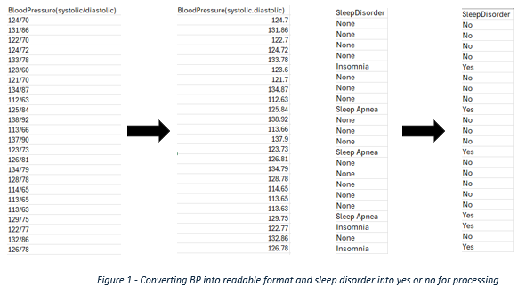

# Data Science Project Part 1
This repository contains all the files for my project as part of my Data Science Professional Practice Module.
You will find:
- The fileset used is available to download from Kaggle: https://www.kaggle.com/datasets/siamaktahmasbi/insights-into-sleep-patterns-and-daily-habits
- The ipynb file that contains the code used as part of my project. The method of analysis was Logistic Regression, and will take you through each step to get the results.
- Power BI was used to create the dashboard and the pbix file is available to download.

# Below is the evaluation of the project, it is 1350 words.
## Data Science Project Research Question: Is poor sleep linked to poor health?
### Executive Summary
This report provides an evaluation of a sleep health study conducted with 400 participants. Logistic regression was used in order to understand the probability of the variables predicting the likelihood of developing a sleep disorder. The final model had an accuracy of 56% and demonstrated that the biggest influences on developing a sleep disorder were high daily step count and being male. Interestingly, physical activity level (PAL) was the most protective factor. Despite the results, the model was heavily biased towards predicting no disorder. 
The report concluded that walking increases the likelihood of developing sleep disorders and recommended that increasing PAL was the preferred preventative. The limitations of this study include lack of details around how participants logged the number of steps e.g. the use of a fitness tracker, and if they counted walking as part of their PAL. Furthermore, the dataset was biased and largely accounted for those without a sleep disorder, future work may consider looking only at participants with sleep disorders.
*1.0	Introduction*
Research shows that sleep is vital for daily functioning, with people spending on average up to one quarter of their day sleeping. Previous sleep studies have implied that poor sleep can be linked to detrimental health outcomes amongst the older population (Chen, Waite and Lauderdale, 2015; Chai and Lu, 2025).
*2.0 Data Collection*
The dataset was sourced from Kaggle, a public platform. As the data was publicly available it had undergone anonymisation, meaning the participants could not be identified, complying with the General Data Protection Regulation (GDPR) (ICO, 2023). Additionally, complying with the Data Ethics Framework, the data was only used for the objective of the project, to find a correlation between health and sleep disorders (Gov.uk, 2020). 
When considering poor health, it was important to consider what factors may lead to developing sleep disorders. Studies suggest links to stress, mental health illnesses, gender, age and weight (Mind.org.uk, 2024, The Sleep Charity, 2023). Some of the significant variables for this project allowed the analysis to understand important aspects of the participants’ daily lives: 
•	Physical activity level (mins/day)
•	Stress level (scaled 1 to 10, a subjective measure)
•	BMI category
•	Blood pressure
•	Heart rate
•	Daily steps
•	Sleep disorder
*3.0 Data Analysis*-
The hypothesis was ‘A BMI score over 25 and low PAL increases the chance of developing a sleep disorder’. The null hypothesis was that this would have no effect on developing a sleep disorder. Analysis took place on Jupyter Lab (JL) as this allowed the code to be ran at each step, ensuring the script worked and, where errors occurred, amended with ease
*3.1 Exploratory data analysis (EDA)*
Prior to testing the data, it was preprocessed for quality and suitability. Using Excel365 initial changes (Fig.1) were made to the format of the blood pressure data, changing the figure to a decimal number as the current format was not recognised in JL. Additionally, changing sleep disorder to Yes and No categories.

Within JL, EDA was completed to check for duplicates, nulls and outliers in the training set, along with changing fields such as sleep disorder, BMI, occupation and gender to number categories. Additionally, the ID column was dropped as it was not a necessary variable (Fig.2). The figures below are examples of EDA performed.

*3.2 Logistic regression*
The purpose of the project was to predict the outcome of the likelihood of developing a sleep disorder, the most suitable method was logistic regression. The data was split into test and train groups, these were randomly selected, with the test group forming 30% of the data.

The model accuracy was 74%, however this rarely predicted an accurate sleep disorder, with a recall value of 5%. To improve the ability to detect a sleep disorder, the code was amended to prevent the model from ignoring the smaller group (Fig.9).

Figure 9 - Top line added to code to ensure model includes smaller class
The amendment reduced the accuracy of the model to 56%, however the recall value for finding sleep disorder participants increased to 34%. Unfortunately, the model (Fig.10) remained unable to accurately predict a sleep disorder with a precision of 26%, likely due to the imbalance of the data towards no disorder. 

The key influence (Fig.11) in developing a sleep disorder was found to be daily steps, with an odds ratio of 34%, contrasting with the most protective factor as PAL at 27%. Interestingly, the average of the variables were over 11,000 steps and 65 minutes PAL, suggesting the participants were highly active. However, being male has been linked as a risk factor for sleep apnea which may explain the increased odds ratio of 23%. In this model, a higher BMI only increased the odds by 9% and was not an influential factor, therefore rejecting the hypothesis. 

A performance comparison (Fig.12) was completed at the end of the analysis to observe if different models would produce better results. KNeighbors had a higher balanced accuracy suggesting it would handle the imbalances better. However, the study was looking at the probability of an outcome and how each variable influences the outcome which is difficult to interpret using KN.

*4.0 Visualisation and Dashboards*
Most data transformation and visualisation occurred Power BI, chosen for its user-friendly interface suited for beginners. Additionally, the size of the data did not require high specification and features that other providers such as Tableau offer (BI Connector, 2022). Figure 13 explains the extract, transform and load process the data underwent to prior to visualisation.

The dashboard was created to give a clear understanding of the data, particularly for the contrasting effects between step count and PAL. The scatter chart shows that there is no clear link between daily steps and PAL, however when filtering the visual (Fig.14) for sleep disorders there is a cluster of participants with a high step count and low PAL. 

*5.0 Discussion*
Studies have shown that physical activity has been a useful tool in sleep management. A meta-analysis on 444 patients with sleep apnea found aerobic exercise combined with resistance training to be more effective than aerobic exercise alone (Peng et al., 2022).  Interestingly, Alnawwar (2023) observed high-intensity PAL were associated with poor sleep quality while exercises such as yoga and tai chi improved sleep and reduced the likelihood of insomnia. On the other hand, there are studies that show walking to be effective in improving sleep, however the majority of the studies focused on the elderly, highlighting the need for further research in young people.
Despite the inconsistencies from studies around PAL and sleep, it is known that poor sleep is a key indicator and often a risk factor for mental illness, this study found no link to stress levels but only one question was based on this. It could suggest that future research requires more questions on the mental health of participants (San & Arranz, 2024). 
Emerging technology such as non-invasive sleep trackers are already being used within the diagnostics of sleep disorders. Wearable over-the-counter trackers have been welcomed into the field to aid the burden of the diseases and limitations in labs, this includes cost and access, with about 37% of the UK population owning and using a wearable device (Statista, 2025). It has been suggested that a moving towards an AI-based sleep studying scoring approach may reduce errors in current testing, it may also be used to identify where immediate treatment is required. However, such use of technology may need to rely on multiple logs of consistent data (Pinilla, Chai-Coetzer & Eckert, 2025). 
The limitations of this study was the lack of information about how participants calculated their PAL and tracked the number of steps taken. Additionally, the form of exercise they participated in, as this would help to give a better understanding of what type of exercise can prevent a sleep disorder. The dataset was also largely biased towards those without a sleep disorder, and future research should have better balance or focus solely on those with a sleep disorder.
*6.0 Conclusion*
It is clear there is a complex relationship between PAL and sleep, with some forms of activity appearing beneficial, existing research is inconsistent. The integration of emerging technologies offers the possibility for advanced research and improving early intervention. However future work must address the limitations such as sample imbalances and wider exercise incorporation.
